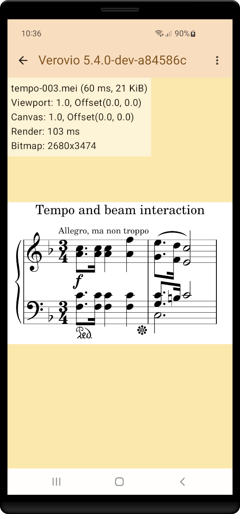
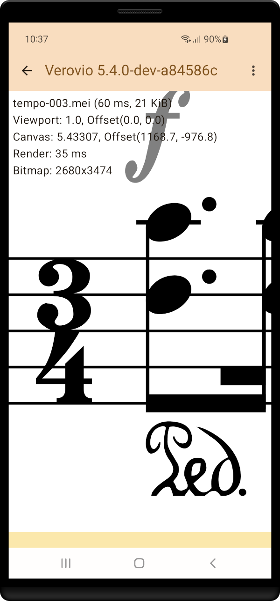
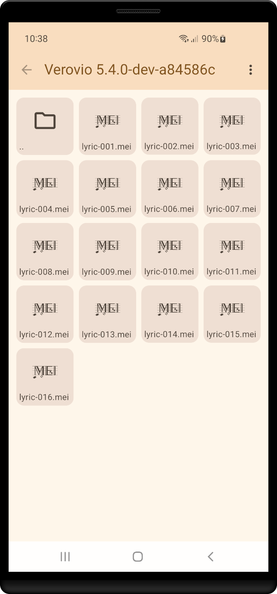

# Verovio Demo App

Show [MEI](https://music-encoding.org/about/)- or MusicXML-Files rendered with [Verovio](https://www.verovio.org/index.xhtml) in an Android App.

This app is currently a tech-demo to show how music engraving via Verovio can be integrated into an Android app.

1|2|3
---|---|---
||

## Download and Installation

see [latest release](https://github.com/henrythasler/verovio-demo-app/releases/latest)

## Build Instructions

1. Install [Ninja](https://ninja-build.org/) : `sudo apt install ninja-build`
2. Clone Verovio library submodule: `git submodule update --init`
3. optional: re-generate font glyphs: see below
4. Copy verovio-data assets to app assets folder: `cp -r app/src/main/cpp/verovio/data/ app/src/main/assets/`
5. Open and build with Android Studio

## Generate Font Glyphs

1. Download FontForge AppImage from https://fontforge.org/en-US/downloads/gnulinux-dl/
2. Re-generate font glyphs: `(cd app/src/main/cpp/verovio/fonts && ./generate_all.sh --fontforge FontForge-2023-01-01.AppImage)` (replace path to AppImage accordingly)

## Known Issues

- In App `build.gradle.kts`: Cmake requires additional `cppFlags += "-llog"` to avoid linker errors for Android log output which in turn generates a ton of warnings during the compile step.

## Resources

### UI, Graphics

- [Material 3 Color Generator](https://www.logicui.com/colorgenerator)